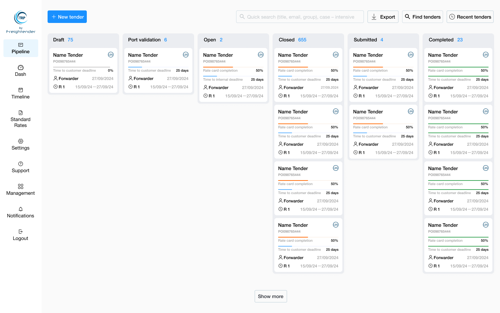

# Pipeline

### Overview

The **Pipeline** is a dynamic board within the TRP system that visually represents the full lifecycle of each tender, guiding users through every stage from creation to completion. It provides a clear, organized view of tender statuses, offering users an intuitive way to monitor and manage tenders as they progress. Each tender moves through predefined statuses, ensuring a structured and transparent process for all participants.

<figure><figcaption></figcaption></figure>
